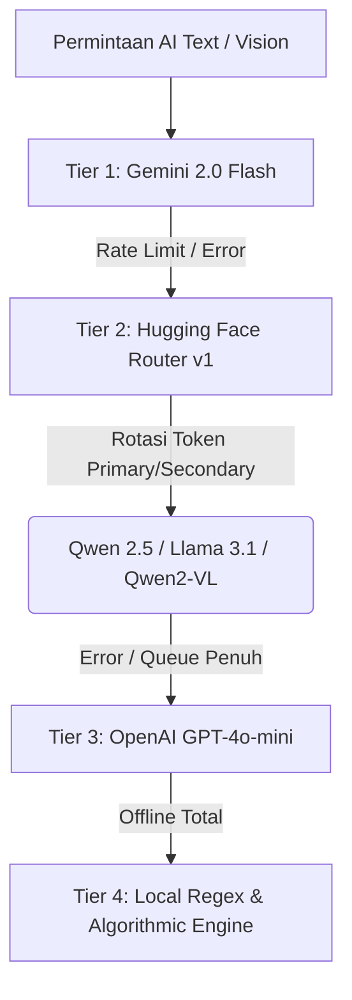

# Finto - Student Financial Companion (SmartFlow V2)

Aplikasi manajemen keuangan cerdas berbasis web dan PWA yang dirancang khusus untuk mahasiswa Indonesia. Mengusung filosofi **"Fokus pada Jatah Harian, bukan Total Saldo"**, Finto dilengkapi dengan ekosistem **Artificial Intelligence (AI)** bertingkat (*Multi-Model Cascade*) yang super cepat, tangguh, dan hemat biaya.

---

## 🚀 Fitur Unggulan

### 🤖 5 Pilar Fitur AI Terintegrasi
1. ⚡ **AI Smart Input (Catat Kilat)**  
   Catat pengeluaran menggunakan bahasa sehari-hari atau gaul (cth: *"makan siang bareng teman 35rb dan ojek 15k"*). AI akan memecah nominal dan mengalokasikannya ke kantong yang tepat secara otomatis.
2. 🔥 **AI Roasting Keuangan**  
   Menganalisis pengeluaran harian dan memberikan komentar atau sindiran finansial yang tajam namun profesional (tanpa emoji) untuk menjaga disiplin anggaran.
3. 📊 **Executive Summary Analitik**  
   Menghasilkan ringkasan eksekutif 3 poin mengenai tren arus kas 30 hari terakhir. Diproses secara asinkron agar grafik visual (*Recharts*) tetap merender secara instan.
4. 🧾 **Scan Struk Belanja (Hybrid OCR + Vision AI)**  
   Membaca foto struk fisik/digital. Memanfaatkan **FastAPI OCR Engine lokal** terlebih dahulu untuk menghemat hingga 100% token AI. Jika struk buram, sistem beralih ke kaskade *Vision AI*.
5. 🎓 **Verifikasi KTM Mahasiswa**  
   Validasi otomatis kartu mahasiswa (Nama, NIM, dan Universitas) dengan detektor lokal serta 3 lapis pengaman AI Vision untuk aktivasi paket berlangganan *Student*.

### 📱 PWA & Mobile Native UX
- **Direct Login Routing**: Ketika diinstal di smartphone (Home Screen PWA) atau aplikasi desktop, Finto langsung membuka halaman **Login / Dashboard** tanpa jeda kedipan (*flickering*) beranda.
- **Dynamic Pockets**: Sistem amplop digital untuk membagi uang saku ke kantong Dompet Utama, Dana Darurat, Tabungan Aset, dan Wishlist.

---

## 🏛️ Arsitektur Ketahanan AI (*Zero-Downtime Resilience Engine*)

Finto dirancang agar **100% tahan gangguan (*bulletproof*)**. Jika salah satu penyedia AI mengalami gangguan (*down*) atau kehabisan limit kuota harian (`429 Rate Limit`), sistem secara transparan beralih ke lapis pengaman berikutnya tanpa memunculkan error kepada pengguna:



### Keunggulan Arsitektur:
- **Dual-Token Auto Rotation**: Menyimpan 2 kunci API Hugging Face (`PRIMARY` & `SECONDARY`). Sistem otomatis merotasi token saat limit tercapai.
- **Strict No-Emoji Policy**: Output AI distandarisasi untuk penggunaan profesional dan bersih dari emoji dekoratif.
- **Local Fallback Assurance**: Setiap rute API dilindungi oleh algoritma matematika lokal (*Rule-based / Regex parsing*) sebagai benteng pertahanan terakhir.

---

## 🛠️ Tech Stack

- **Framework**: Next.js 14 (App Router), React 18, TypeScript
- **Styling**: Tailwind CSS, Lucide React Icons
- **Database & ORM**: MySQL / PostgreSQL via Prisma ORM
- **AI Engines**: Google Generative AI (`gemini-2.0-flash`), Hugging Face Serverless API (`Qwen/Qwen2.5-7B-Instruct`, `Qwen/Qwen2-VL-7B-Instruct`), OpenAI SDK (`gpt-4o-mini`)
- **PWA**: `@ducanh2912/next-pwa` dengan dukungan Service Worker mandiri

---

## ⚙️ Persiapan & Setup Lokal

### 1. Kloning & Instalasi Dependencies
```bash
git clone <repository-url>
cd smartflowV2
npm install
```

### 2. Konfigurasi Environment Variables (`.env`)
Salin contoh file environment dan isi variabel berikut:
```env
# Database Connection
DATABASE_URL="mysql://root:@localhost:3306/smartflow_db"
NEXTAUTH_SECRET="rahasia-super-aman-untuk-jwt"

# AI Provider Keys
GEMINI_API_KEY="AIzaSy..."
OPENAI_API_KEY="sk-proj-..."

# Hugging Face Dual-Token Rotation
HF_TOKEN_PRIMARY="hf_..."
HF_TOKEN_SECONDARY="hf_..."

# Local FastAPI OCR Service (Opsional)
OCR_BACKEND_URL="http://localhost:8000"
OCR_API_KEY="rahasia-ocr"
```

### 3. Migrasi & Seeding Database
```bash
npx prisma migrate dev --name init
npx prisma db seed
```
> **Catatan**: Perintah `seed` akan membuat akun demo default: `budi@smartflow.test` (password: `password123`).

### 4. Menjalankan Server
```bash
npm run dev
```
Buka `http://localhost:3000` di browser Anda.

---

## 🧪 Skrip Pengujian AI
Untuk memverifikasi kesehatan koneksi AI dan rotasi token di terminal:
```bash
# Pengujian koneksi Hugging Face Router
powershell -ExecutionPolicy Bypass -File ./test-huggingface.ps1
```

---

## 📄 Lisensi
Dibuat dengan ❤️ untuk mahasiswa Indonesia. Hak Cipta © 2026 Finto Team.
