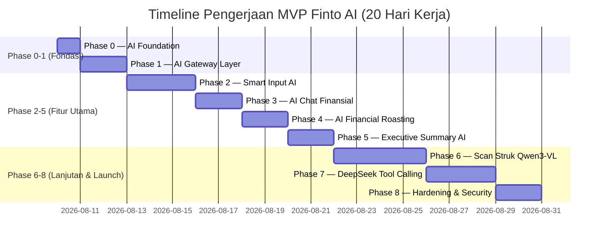

# 🚀 Finto AI Development Plan — MVP Public (100–1.000 User)

**Target Release:** 2–3 Minggu (19–21 Hari Kerja)  
**Target Audience:** Demo Publik & Pengujian Dosen / 100–1.000 Pengguna Aktif  
**Tech Stack:** Next.js 14 (App Router), TypeScript, Prisma ORM (PostgreSQL), Hugging Face Serverless Router API  
**Model Utama:** 
- **Text & Agent (Tool Calling):** `deepseek-ai/DeepSeek-V4-Flash-0731`
- **Vision & Multimodal (Scan Struk & KTM):** `Qwen/Qwen3-VL-8B-Instruct`

---

## 🎯 Ringkasan Eksekutif & Tujuan Proyek

Rencana ini memfokuskan pengembangan AI pada platform **Finto (SmartFlow V2)** menjadi sistem terpadu berstandar industri (*AI-Native Personal Finance Agent*). Seluruh integrasi AI dipusatkan pada satu gateway modular di `lib/ai/` untuk menghindari duplikasi kode, menjaga skalabilitas, serta menjamin performa tinggi di bawah kuota Hugging Face Router API.

---

## 🏛️ Arsitektur AI Gateway (`lib/ai/`)

Seluruh komunikasi dengan AI dihimpun dalam struktur folder berikut:

```text
lib/
 └── ai/
      ├── client.ts         # Wrapper HTTP Client ke Hugging Face Router API (v1 OpenAI-compatible)
      ├── provider.ts       # Provider spesifik DeepSeek-V4-Flash & Qwen3-VL-8B
      ├── router.ts         # Dispatcher utama request AI & fallback token rotation
      ├── models.ts         # Registrasi model AI & parameter konfigurasi
      ├── tools.ts          # Definisi AI Tool Calling (fungsi Prisma internal)
      ├── types.ts          # Type definitions & Zod validation schemas
      └── prompts/          # Template System Prompt terpusat
           ├── smart-input.ts
           ├── roast.ts
           ├── summary.ts
           ├── receipt-scan.ts
           └── chat.ts
```

---

## 📅 Roadmap Pelaksanaan (19–21 Hari Kerja)



---

### 🔹 Phase 0 — AI Foundation (1 Hari)
**Tujuan:** Memastikan kunci API dan konfigurasi environment siap tanpa perubahan berulang.

* Setup akun Hugging Face & Token Access (Primary + Secondary untuk Token Rotation).
* Pengaturan variabel lingkungan di `.env` & `.env.example`:
  ```env
  HF_TOKEN_PRIMARY=hf_xxxxxxxxxxxxxxxxx
  HF_TOKEN_SECONDARY=hf_xxxxxxxxxxxxxxxxx

  AI_TEXT_MODEL=deepseek-ai/DeepSeek-V4-Flash-0731
  AI_VISION_MODEL=Qwen/Qwen3-VL-8B-Instruct
  ```

---

### 🔹 Phase 1 — AI Gateway Layer (2 Hari)
**Tujuan:** Membangun pintu gerbang tunggal untuk semua layanan AI dengan fitur Token Rotation & Structured Output.

* Implementasi `lib/ai/client.ts`: Abstraksi fetch ke Hugging Face Router API (`https://router.huggingface.co/v1/chat/completions`).
* Implementasi Token Rotation & Retry Logic (otomatis beralih ke token cadangan jika HTTP 429 / Rate Limit).
* Integrasi **Zod Schema Validator** untuk menjamin respons JSON selalu sesuai tipe TypeScript.
* Refactoring helper lama `lib/huggingface.ts` ke dalam arsitektur baru `lib/ai/`.

---

### 🔹 Phase 2 — Smart Input AI (3 Hari) | Prioritas: ⭐⭐⭐⭐⭐
**Tujuan:** Memproses input teks alami transaksi menjadi JSON terstruktur untuk disimpan ke database Prisma (`Transaction` & `Pocket`).

* **Model:** DeepSeek-V4-Flash-0731.
* **Flow:** Input Pengguna → DeepSeek Parser → Zod Validation → Transaksi Prisma.
* **Fitur Utama:**
  - Ekstraksi multi-transaksi dalam 1 kalimat (contoh: *"makan ayam 25rb, parkir 3rb, kopi 18k"*).
  - Penyesuaian otomatis dengan daftar Kategori User (`NEED` vs `WANT`).
  - Deteksi tanggal relatif WIB (kemarin, lusa, tgl 5).
* **Target Spec:** Akurasi nominal ≥ 95%, Waktu Respon ≤ 2.0 detik.

---

### 🔹 Phase 3 — AI Chat Finansial (2 Hari) | Prioritas: ⭐⭐⭐⭐⭐
**Tujuan:** Menyediakan asisten tanya-jawab finansial interaktif yang memahami konteks dompet dan anggaran pengguna.

* **Model:** DeepSeek-V4-Flash-0731.
* **Endpoint:** `/api/ai/chat`
* **Fitur Utama:**
  - Konsultasi sisa anggaran harian dan keterjangkauan belanja.
  - Penjelasan istilah keuangan dengan bahasa populer mahasiswa.
  - Simulasi dampak pengeluaran rutin terhadap sisa uang saku bulanan.

---

### 🔹 Phase 4 — AI Financial Roasting (2 Hari) | Prioritas: ⭐⭐⭐⭐
**Tujuan:** Menghasilkan ulasan keuangan bergaya Gen-Z yang blak-blakan, tajam, dan edukatif berdasarkan data transaksi nyata 30 hari.

* **Model:** DeepSeek-V4-Flash-0731.
* **Endpoint:** `/api/ai/roast`
* **Input Data:** Riwayat transaksi 30 hari, saldo 4 kantong (`Pocket`), persentase belanja `WANT` (konsumtif), serta `User.paydayDate`.
* **Output Rules:** Maksimal 3 kalimat, tanpa emoji, nada bicara profesional namun tajam, sebutkan angka & kategori spesifik.

---

### 🔹 Phase 5 — Executive Summary AI (2 Hari) | Prioritas: ⭐⭐⭐⭐
**Tujuan:** Menyajikan analisis audit keuangan berkala dalam format narasi ringkas terstruktur.

* **Model:** DeepSeek-V4-Flash-0731.
* **Endpoint:** `/api/ai/summary` (Refactor dari `/api/ai/analytics-summary`)
* **Output 4 Poin Utama:**
  1. **Likuiditas & Net Flow:** Total pemasukan vs pengeluaran, *savings rate*, dan *liquid runway* (ketahanan kas).
  2. **Evaluasi Anggaran (50/30/20):** Rasio Kebutuhan (`NEED`) vs Keinginan (`WANT`).
  3. **Audit Transaksi Diskresioner:** Potensi penghematan dari pos gaya hidup.
  4. **Komposisi Kantong & Aset:** Evaluasi alokasi saldo pada kantong-kantong user.

---

### 🔹 Phase 6 — Scan Struk Vision AI (4 Hari) | Prioritas: ⭐⭐⭐⭐
**Tujuan:** Membaca foto struk belanja/kwitansi menggunakan model Vision dan mengekstraksi data transaksi secara presisi.

* **Model:** Qwen3-VL-8B-Instruct.
* **Endpoint:** `/api/ai/scan-receipt`
* **Flow:**
  ```text
  Upload Foto -> Resize (max 1600px) & Compress -> Qwen3-VL Vision API -> Structured JSON -> Review Modal UI -> Save Transaction
  ```
* **Human-in-the-Loop:** Pengguna **wajib melakukan review** pada `ScanReceiptModal.tsx` sebelum data benar-benar disimpan ke database (mencegah salah pencatatan).

---

### 🔹 Phase 7 — AI Tool Calling Agent (3 Hari) | Prioritas: ⭐⭐⭐⭐⭐
**Tujuan:** Memberikan kemampuan pada DeepSeek untuk mengeksekusi aksi keuangan secara mandiri berdasarkan perintah pengguna.

* **Model:** DeepSeek-V4-Flash-0731 (Function Calling mode).
* **Internal Tools (TypeScript Handlers):**
  - `createTransaction({ amount, categoryId, pocketId, notes, date })`
  - `updateTransaction({ id, amount, notes })`
  - `deleteTransaction({ id })`
  - `getPocketBalance({ pocketType })`
  - `getDailyPerformance()`
  - `getMonthlySummary()`
* **Security Guard:** `userId` selalu diautentikasi dari JWT Server Session (AI tidak bisa mengakses data pengguna lain).

---

### 🔹 Phase 8 — Hardening, Security & Analytics (2 Hari) | Prioritas: ⭐⭐⭐⭐⭐
**Tujuan:** Memastikan aplikasi aman, stabil, dan siap menampung 100–1.000 pengguna bersamaan.

* **Rate Limiting per Tier Subscription:**
  - **Trial:** 30 request AI / hari
  - **Student (Verifikasi KTM):** 100 request AI / hari
  - **Premium:** Unlimited (dengan fair-use policy)
* **Logging & Observability:** Monitor waktu respon, konsumsi token, dan rasio error API.
* **Graceful Degradation:** Tampilan error yang rapi dan fallback statis jika terjadi gangguan pada API Hugging Face.

---

## 📊 Matriks API Internal & Entitas Database

| API Route | Model AI | DB Entity Terkait | Output Standard |
| :--- | :--- | :--- | :--- |
| `/api/ai/smart-input` | DeepSeek-V4-Flash | `Transaction`, `Pocket`, `Category` | `Array<TransactionJSON>` |
| `/api/ai/chat` | DeepSeek-V4-Flash | `User`, `Pocket`, `Transaction` | `ChatMessage` |
| `/api/ai/roast` | DeepSeek-V4-Flash | `DailyPerformance`, `Transaction` | `RoastText` |
| `/api/ai/summary` | DeepSeek-V4-Flash | `Transaction`, `Pocket` | `SummaryPoints` |
| `/api/ai/scan-receipt` | Qwen3-VL-8B | `ScanReceiptModal` (Frontend state) | `ReceiptJSON` |
| `/api/ai/agent` | DeepSeek-V4-Flash | All Prisma Models | `ToolExecutionResult` |

---

## ✅ Checklist Deliverables Sebelum Launch MVP (SELESAI 100%)

- [x] Variabel `.env` terkonfigurasi dengan HF Tokens & Model Identifiers.
- [x] Directory `lib/ai/` selesai dibuat dan teruji.
- [x] Endpoint `/api/ai/smart-input` mampu memproses kalimat majemuk.
- [x] Fitur Chat Finansial merespon pertanyaan dengan konteks user (`/api/ai/chat` & `AiChatModal.tsx`).
- [x] Fitur AI Roasting menghasilkan sindiran spesifik tanpa emoji.
- [x] Executive Summary menyajikan 4 poin audit keuangan.
- [x] Scan Struk Qwen3-VL berhasil membaca foto dan terhubung ke `ScanReceiptModal.tsx`.
- [x] DeepSeek Tool Calling sukses mengeksekusi `createTransaction()`.
- [x] Middleware Rate Limiter aktif membatasi request per user plan.
- [x] Semua API Route lulus uji coba waktu respon (≤ 3 detik).
